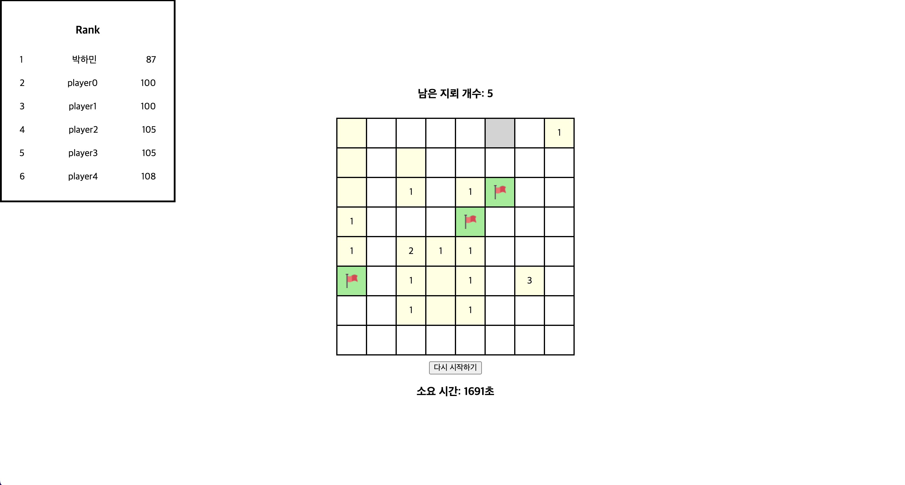

# Mine Sweeper

- 2022.4.29: 개발 시작, 기능 구현
- 2022.4.30: README.md 작성, 코드 분리, 작은 수정



---

## 실행 방법

1. 터미널을 열어 프로젝트를 다운로드할 위치 경로로 이동합니다.
2. `git clone https://github.com/peppermintc/mine-sweeper.git` 명령어로 프로젝트를 클론합니다.
3. `yarn install` 명령어로 node_modules를 설치합니다.
4. `yarn start` 명령어로 클라이언트 서버를 실행합니다.

---

## 사용 기술

- Create React App
- TypeScript
- Styled Components
- Prettier

---

## 프로젝트 설명

### 셀 상태 (cellState)

cellState는 4가지 상태 중 한가지를 가집니다

- `'mine'`: 지뢰 O
- `'none'`: 지뢰 X, 사용자가 확인하지 않은 상태
- `'flag'`: 깃발, 사용자가 지뢰로 간주한 상태
- `number`: 지뢰 X, 사용자가 확인한 상태, 인접 셀 지뢰 개수

### 셀 클릭 동작

셀 상태(cellState)값에 따라 다르게 동작합니다

- 좌 클릭
  - `'mine'`: gameState > GAME_OVER
  - `'none'`: cellState > 주변 지뢰 개수
  - `'flag'`: 아무 동작도 일어나지 않음
  - `number`: 아무 동작도 일어나지 않음
- 우 클릭
  - `'mine'`: cellState > flag, mineCount - 1
    - mineCount가 0이면 cellState를 변경하지 않고 아무 동작도 일어나지 않음
  - `'none'`: cellState > flag, mineCount - 1
    - mineCount가 0이면 cellState를 변경하지 않고 아무 동작도 일어나지 않음
  - `'flag'`: cellState flag > 원본(MINE_BOARD_ORIGINAL)의 cellState, mineCount + 1
  - `number`: 아무 동작도 일어나지 않음

### 지뢰보드 원본과 사본 (MINE_BOARD_ORIGINAL & mineBoard)

깃발 기능을 사용할 때 cellState가 지워지고 값이 `flag`로 변합니다. 때문에 원본 값은 따로 보관시키고 동적으로 변화하는 복사본 보드가 필요했습니다. 원본 데이터 관련 변수들은 변수명에 영어 대문자를 사용하였습니다.

- `MINE_BOARD_ORIGINAL`: 지뢰보드 원본
- `mineBoard`: 지뢰보드 복사본

### Util 함수 구성

게임에서 뷰와 분리가 가능한 독립적인 기능을하는 함수들을 Utils 폴더에 따로 분리하였습니다.

- `countMineAround.ts`: 인접 셀 지뢰 개수 카운트
- `checkComplete.ts`: 게임 성공 여부 체크
  - `foundAllNone`: 지뢰가 아닌 모든 칸을 확인했는지 판별 (mineBoard에서 `number` 개수를 카운트)
  - `foundAllMine`: 지뢰를 모두 깃발로 알맞게 표시했는지 판별 (MINE_BOARD_ORIGINAL `mine`과 mineBoard `flag`를 비교)
- `createNewBoard.ts`: 업데이트된 새로운 보드를 리턴
  - `noneToNumber`: 클릭한 cellState `'none'`에서 `number`로 변경
  - `somethingToFlag`: 클릭한 cellState를 `'flag'`로 변경
  - `flagToSomething`: 클릭한 cellState를 `'flag''`에서 원본보드 cellState로 변경

### gameState에 따른 동작

게임 상태를 나타내는 gameState 값에 따라 모달을 열고 닫는 동작을 수행합니다.

- `'COMPLETE'`: 성공 모달 표시
- `'GAME_OVER'`: 게임 오버 모달 표시
- `'PLAYING'`: 모든 모달을 닫고 새로운 게임 시작

### UI 컴포넌트 구성

- `남은 지뢰 개수`: MineCount.tsx,
- `8x8 보드`: MineBoard.tsx, Cell.tsx
- `소요 시간`: Timer.tsx
- `기록 순위표`: RankTable.tsx
- `성공 모달`: CompleteModal.tsx
- `실패 모달`: GameOverModal.tsx

### 폴더 구성

- `components`: React UI 컴포넌트 파일 보관
- `data`: 보드 데이터, 랭킹 데이터 원본 보관
- `img`: 이미지 파일 보관
- `interfaces`: 타입스크립트 인터페이스, 타입 코드 보관
- `utils`: util 함수들 보관

### 상태 값

- App State
  - `rankData` // 복사본
  - `mineBoard` // 복사본
  - `mineCount` // 복사본
  - `gameState`
  - `currentTime`
  - `showGameOverModal`
  - `showCompleteModla`
- boardData.ts
  - `TOTAL_CELL_COUNT` // 원본
  - `MINE_COUNT` // 원본
  - `MINE_BOARD_ORIGINAL` // 원본
- 상태 타입
  - `GameState`: 'GAME_OVER' or 'COMPLETE' or 'PLAYING'
  - `CellState`: 'none' or 'mine' or 'flag' or number;
  - `Board`: CellState[][]
  - `PositionInfo`: { row: number, column: number }
  - `Player`: { name: string, time: number }
  - `RankData`: Player[]

### 테스트

`src/data/boardData.ts` 파일에 테스트 셋들이 주석처리 되어있습니다. `MINE_COUNT`와 `MINE_BOARD_ORIGINAL`의 주석 처리를 변경하여 아주 쉬운 난이도도 지뢰보드를 변경시켜 볼 수 있습니다.

### 개발하며 중요시 생각했던 점

- 변수, 함수 네이밍
  - 파악하기 어려운 이름 피하기
  - 비슷한 유형은 유사성을 가지도록 하기
- 타입스크립트 타입 정의를 잘 사용해보기
- 모든 파일들의 코드 스타일 일관성 유지
- 커밋 메시지에 라벨 사용
- 알아보기 쉬운 커밋 단위로 분리

---

### Redux를 사용하지 않았던 선택에 대하여

프로젝트 규모가 크지 않기 때문에 Prop drilling 문제가 없어 리덕스를 사용하지 않았습니다. 때문에 비즈니스 로직들이 Props를 통해 컴포넌트들에게 전달되었습니다. 개발 후에 이 선택에 대해 느낀점을 적어보았습니다.

- Prop drilling 측면으로는 불필요

  - Prop drilling 최대 depth가 두단계로 깊지 않아서 약간의 집중력만 사용한다면 코드 파악에 큰 문제는 없었습니다.
    (`예) App > MineBoard > Cell`)

- 컴포넌트 동작 예상 가능

  - 전달되는 Props들을 읽음으로써 컴포넌트 파일을 열어서 읽어보지 않아도 어떤 기능을 수행하는지 미리 파악할 수 있었던 측면에서는 좋았습니다.

  ```HTML
  예) <CompleteModal updateRankData={updateRankData} updateGameState={updateGameState} ... />
  ```

- 새로운 Props 추가 작업의 번거로움
  

  - 새롭게 Props로 전달할 값을 추가할 때마다 3곳(`JSX`, `interface`, `component file`)에 코드를 추가해야하는 작은 번거로움이 있었습니다.

- 늘어나는 JSX 라인에 대한 부담

  - 점점 증가하는 JSX 라인이 코드 가독성에 안좋은 영향을 미치지 않을까 조금 염려스러웠습니다.

- 결론

  - 이번 프로젝트는 규모가 작기 때문에 Redux를 사용하지 않았어도 괜찮은 정도였던 것 같습니다. 하지만 프로젝트가 조금만 더 커지더라도 비즈니스 로직을 따로 분리시켜서 Props로 전달하지 않는 방식이 유지보수성, 가독성 측면에서 더 좋겠다는 생각이 들었습니다.

---

### 게임 성공 조건 정의

셀을 클릭하면 `mineBoard` 배열을 업데이트하도록 구현하였습니다. (`mineBoard`의 업데이트는 useEffect hook으로 감지하였습니다.) 업데이트가 감지될 때마다 게임 성공여부를 체크하도록 하였습니다. 성공 여부 체크를 위해서 성공 조건을 명확하게 정의해야했습니다. 정의한 성공 조건은 2가지입니다. `지뢰가 아닌 셀을 모두 찾아낸 경우`와 `모든 지뢰 위에 깃발을 꽂은 경우`입니다.

#### 1. 지뢰가 아닌 셀을 모두 찾아낸 경우

셀 클릭시 지뢰가 아니면 `cellState`값이 number 타입으로 바뀝니다. number 타입을 가진 셀은 확정적으로 지뢰가 아닌 셀이고 이것을 카운트해서 `(전체 셀 개수 - 전체 지뢰 개수)`와 같을 경우 성공으로 체크하도록 하였습니다.

구현부: util 폴더 checkComplete.foundAllNone 함수

#### 2. 모든 지뢰 위에 깃발을 꽂은 경우

원본 지뢰보드(`MINE_BOARD_ORIGINAL`)와 현재 사용 중인 복사본 지뢰보드(`mineBoard`)의 값을 비교해서 `flag`를 `mine`에 정확하게 꽂은 경우를 카운트하였습니다. 정확하게 깃발을 꽂은 경우가 지뢰의 총 개수와 같다면 성공으로 체크하는 로직입니다.

구현부: util 폴더 checkComplete.foundAllMine 함수

매번 보드 업데이트시마다 이 경우를 체크하는 것은 효율적이지 않아서 깃발을 최대로 꽂아서 남은 지뢰 개수 카운트가 0이 되었을 때만 이 경우를 체크하도록 하였습니다.

구현부: App 컴포넌트의 useEffect

---

### 구현 시작 전 설계에 대한 후기

과제 가이드라인을 읽고 바로 코드 작성을 시작하지 않고 설계하는 시간을 가졌습니다. 사전 설계가 생산성이나 프로젝트 구조 측면에서 많은 도움이 되었습니다.

#### 1. 설계 내용

프로젝트 설계를 할 때는 전달받은 가이드라인을 바탕으로 3가지 항목으로 나누어 설계를 진행하였습니다.

1. 컴포넌트 설계: 구현할 컴포넌트들을 적절한 작명과 함께 리스트로 작성해보았습니다. 실제 구현을 하면서 미리 작성했던 설계 명세를 자주 확인하였고 이것이 다음 수행할 작업에 대한 인지와 개발 방향을 잃지 않는데 도움이 되었습니다.

2. 상태 값 설계: 키 포인트가 될 상태 값들, 전역적으로 관리해야될 상태 값들을 정의하였습니다. 작성할 때는 타입스크립트에서 타입을 정의하는 것과 유사하게 작성하였습니다. 구현하면서는 타입스크립트를 사용하면서 코드 내에서 어느정도 상태 값들을 파악할 수 있기 때문에 많이 참고하지는 않았습니다.

3. 구현 순서 설계: 핵심 기능부터 구현하고 부수적인 기능을 구현하는 순서로 계획하였습니다. 설계 단계에서 정했던 순서와 실제 구현 순서는 많이 다르게 진행되었습니다. 실제 구현하면서는 기능 단위로 먼저 필요한 뷰 컴포넌트를 간단하게 구현한 후 기능적인 로직을 구현하는 순서로 진행하였습니다. 향후 설계에 뷰 구현과 기능 구현을 분리된 단계로 생각하고 설계한다면 도움이 될 것 같습니다.

#### 2. 느낀점

사전 설계와 완벽히 일치하도록 구현하지는 않았습니다. 하지만 설계는 완전히 똑같이 만들어내려고 수행하는 것이 아니라는 것을 알 수 있었습니다. 체감한 가장 큰 효용은 생산성의 증가였습니다. 미리 계획한 컴포넌트, 상태 값, 구현 순서들을 참고하는 것만으로도 도중에 다음 구현은 무엇을 해야하는지 고민하는 시간이 현저히 줄어들었습니다. 그리고 계획한 내용을 업데이트하며 프로젝트를 쌓아올리는 느낌을 받을 수 있었습니다.

---

### 프로젝트 트리 구조

```
├── README.md
├── package-lock.json
├── package.json
├── previews
│ └── propAdding.png
├── public
│ ├── favicon.ico
│ ├── index.html
│ └── manifest.json
├── src
│ ├── App.tsx
│ ├── components
│ │ ├── Cell.tsx
│ │ ├── CompleteModal.tsx
│ │ ├── GameOverModal.tsx
│ │ ├── MineBoard.tsx
│ │ ├── MineCount.tsx
│ │ ├── ModalContainer.tsx
│ │ ├── RankTable.tsx
│ │ └── Timer.tsx
│ ├── data
│ │ ├── boardData.ts
│ │ └── rankData.ts
│ ├── img
│ │ ├── explosion.png
│ │ └── redFlag.png
│ ├── index.css
│ ├── index.tsx
│ ├── interfaces
│ │ └── index.ts
│ ├── react-app-env.d.ts
│ └── utils
│ ├── checkComplete.ts
│ ├── countMineAround.ts
│ └── createNewMineBoard.ts
├── tsconfig.json
└── yarn.lock
```

---

🙂 아래 내용은 코드 작업 전 설계를 작성했던 내용으로 실제 구현하며 달라진 점이 많습니다.

## 구현 시작 전

### 1. 컴포넌트 설계

구현 시작 전 요구 사항 구현에 필요한 컴포넌트들이 무엇이 있을까 생각해보았습니다.

- `MineSweeper`: 지뢰찾기 8X8 컨테이너
  - `Cell`: 지뢰찾기 셀
- `MineCounter`: 남은 지뢰 개수 표시
- `Timer`: 시작 후 현재까지 걸린 시간 표시
- `ResetButton`: 게임 초기화 버튼
- `FailModal`: 실패했음을 알리고 다시 시작을 알리는 모달
- `CompleteModal`: 성공을 알리고 기록을 표시 랭킹 진입시 아이디 입력
- `Rank`: 기록 순위표 표시
- `Guide`: 게임 설명 표시

### 2. 상태 값 설계

구현 시작 전 필요한 상태 값들이 어떤 것들이 있을까 생각해보았습니다.

상태 관리는 전역 상태 관리 라이브러리를 따로 사용하지 않기로 결정하였습니다.

앱 규모가 크지 않아서 `Prop drilling`이 복잡하게 발생하지는 않을 것 같았습니다.

```javascript
// 앱 State
{
  mines: CellState[][]; // 지뢰 판의 상태를 2차원 배열로 관리
  timer: number;  // 시간 값 초 단위
  isComplete: boolean;  // 성공시 Complete 모달 띄워주기
  isFail: boolean;  // 성공시 Fail 모달 띄워주기
  rank: Record[]; // 랭킹 기록
}

// CellState
// number로 표시하면 헷갈릴 수 있을 것 같아 string 값들로 표현
type CellState = "none" | "mine" | "flag";

// Record
interface Record {
  name: string; // 이름
  time: number; // 시간 값 초 단위
}

```

### 3. 구현 순서 설계

1. `MineSweeper`와 `Cell` 컴포넌트 동작 구현
2. `MineCounter` 컴포넌트와 깃발 기능 구현
3. `ResetButton` 컴포넌트
4. `Timer` 컴포넌트
5. `FailModal` 컴포넌트
6. `CompleteModal` 컴포넌트
7. 랭킹 관련 기능
8. 게임 설명 표시

---

## 기타

최근 토이 프로젝트로 작업했던 TV Focus Control 프로젝트 링크도 함께 전달드립니다. 토이 프로젝트를 만드는 것을 좋아해서 이외에도 github에서 여러 프로젝트들을 보실 수 있습니다!

- https://peppermintc.github.io/tv-focus-control/
- https://github.com/peppermintc/tv-focus-control
