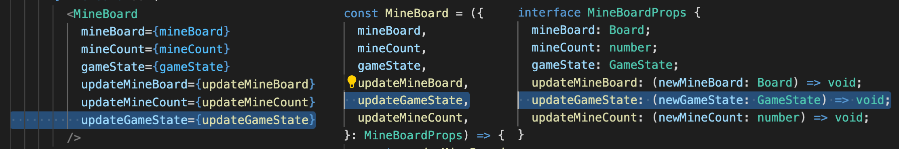

# Mine Sweeper

작업 기간: 2022/4/29 ~ 2022/5/1

---

## 구현 후 정리

### Redux를 사용하지 않았던 것은 잘 한 선택이었는지에 대한 고민

Prop drilling 최대 depth가 두단계로 깊지 않았고 (`App > MineBoard > Cell`)

컴포넌트 Props들을 읽음으로써 컴포넌트 파악에 도움이 될 수도 있다는 측면에서는 좋은 선택이었던 것 같습니다.

```HTML
예) <CompleteModal updateRankData={updateRankData} updateGameState={updateGameState} ... />

// 이 모달에서는 랭크 데이터와 게임 상태를 업데이트한다는 것을 컴포넌트 코드 내부를 확인하기 전에 알 수 있음
```

불편했던 점은 컴포넌트에 Props로 값들을 전달하는 경우가 많아지다보니

새롭게 전달할 값을 추가할 때마다 3곳(`JSX`, `interface`, `component file`)에 코드를 추가해야하는 작은 번거로움이 있었습니다.



만약 Redux를 사용했다면 이것에 대한 부담은 조금 덜었을 수도 있을 것 같습니다.

앱의 기능이 조금만 커져도 전역상태관리 라이브러리를 사용하는 것이 좋겠다는 생각이 들었습니다.

---

### 헷갈렸던 부분

지뢰 한 칸 단위인 `Cell` 클릭시 `mineBoard`를 업데이트하도록 구현하였습니다. `mineBoard` 업데이트를 `useEffect hook`으로 감지하여 게임 성공여부를 체크하도록 하였습니다.

성공 여부 체크를 위해서 `성공 조건`을 명확하게 정의해야했습니다. 정의한 성공 조건은 2가지였고 이를 충족하면 성공으로 간주하였습니다.

`지뢰가 아닌 셀을 모두 찾아낸 경우`와 `모든 지뢰 위에 깃발을 꽂은 경우`입니다.

#### 1. 지뢰가 아닌 셀을 모두 찾아낸 경우

셀 클릭시 지뢰가 아니면 `cellState`값이 `number 타입`으로 바뀝니다. 그렇기 때문에 보드에서 `number 타입`을 가진 셀을 카운트하여 `(전체 셀 개수 - 전체 지뢰 개수)`와 같으면 성공으로 체크하는 로직입니다.

(`util 폴더의 checkComplete.foundAllNone 함수`)

#### 2. 모든 지뢰 위에 깃발을 꽂은 경우

원본 지뢰보드(`MINE_BOARD_ORIGINAL`)와 현재 사용 중인 복사본 지뢰보드(`mineBoard`)의 값을 비교해서 `flag`를 `mine`에 정확하게 꽂은 경우를 카운트하였습니다. 정확하게 깃발을 꽂은 경우가 지뢰의 총 개수와 같다면 성공으로 체크하는 로직입니다.

(`util 폴더의 checkComplete.foundAllMine 함수`)

---

## 구현 시작 전 설계

### 컴포넌트 설계

구현 시작 전 요구 사항 구현에 필요한 컴포넌트들이 무엇이 있을까 생각해보았습니다.

- `MineSweeper`: 지뢰찾기 8X8 컨테이너
  - `Cell`: 지뢰찾기 셀
- `MineCounter`: 남은 지뢰 개수 표시
- `Timer`: 시작 후 현재까지 걸린 시간 표시
- `ResetButton`: 게임 초기화 버튼
- `FailModal`: 실패했음을 알리고 다시 시작을 알리는 모달
- `CompleteModal`: 성공을 알리고 기록을 표시 랭킹 진입시 아이디 입력
- `Rank`: 기록 순위표 표시
- `Guide`: 게임 설명 표시

### 상태 값 설계

구현 시작 전 필요한 상태 값들이 어떤 것들이 있을까 생각해보았습니다.

상태 관리는 전역 상태 관리 라이브러리를 따로 사용하지 않기로 결정하였습니다.

앱 규모가 크지 않아서 `Prop drilling`이 복잡하게 발생하지는 않을 것 같았습니다.

```javascript
// 앱 State
{
  mines: CellState[][]; // 지뢰 판의 상태를 2차원 배열로 관리
  timer: number;  // 시간 값 초 단위
  isComplete: boolean;  // 성공시 Complete 모달 띄워주기
  isFail: boolean;  // 성공시 Fail 모달 띄워주기
  rank: Record[]; // 랭킹 기록
}

// CellState
// number로 표시하면 헷갈릴 수 있을 것 같아 string 값들로 표현
type CellState = "none" | "mine" | "flag";

// Record
interface Record {
  name: string; // 이름
  time: number; // 시간 값 초 단위
}

```

### 구현 순서 설계

1. `MineSweeper`와 `Cell` 컴포넌트 동작 구현
2. `MineCounter` 컴포넌트와 깃발 기능 구현
3. `ResetButton` 컴포넌트
4. `Timer` 컴포넌트
5. `FailModal` 컴포넌트
6. `CompleteModal` 컴포넌트
7. 랭킹 관련 기능
8. 게임 설명 표시

---

### 실제 구현 순서

1. `MineBoard` 컴포넌트 구현
2. `Cell` 컴포넌트 구현
   1. `Cell` 뷰 구현
   2. `Cell` 클릭시 동작 구현
      1. `지뢰 아닌 Cell 클릭시` 동작 구현
      2. `지뢰 Cell 클릭시` 동작 구현
